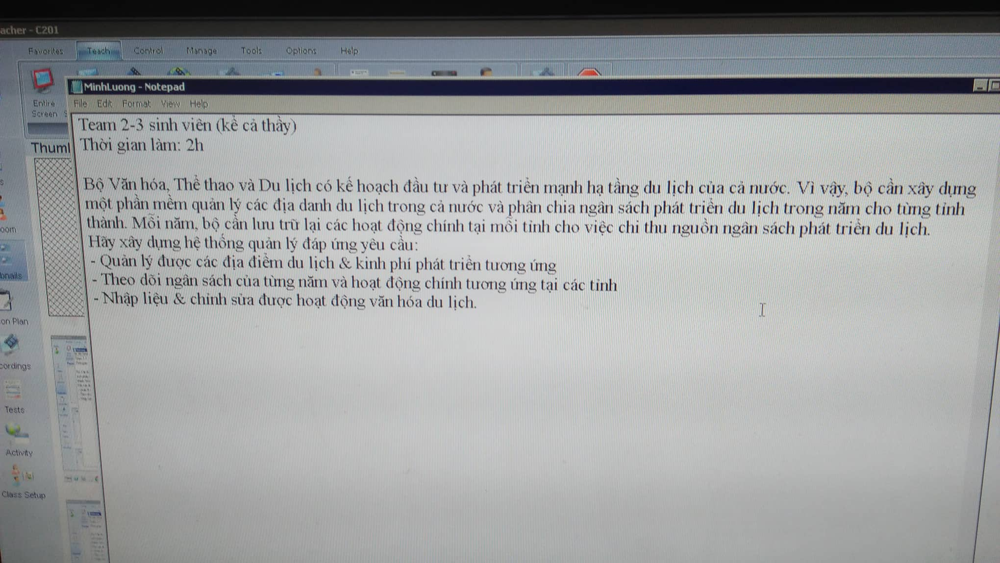

# thcsdl_qldl
Đề thi thử môn Cơ sở dữ liệu - Winforms
## Đề bài:

## Cấu trúc Database:
TINHTHANH: (MATINH, TENTINH)

DIADANH: (MADD, TENDD, MATINH)

NGANSACH: (MATINH, NAM, TIEN)

HOATDONG: (STT, MADD, TENHD, CHIPHI)